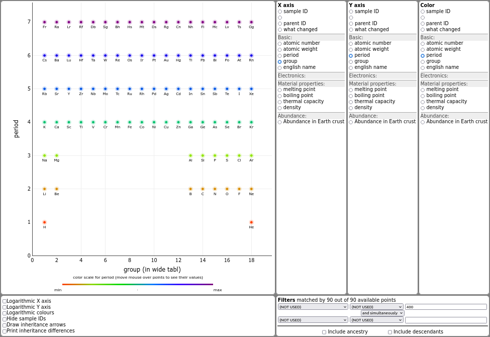
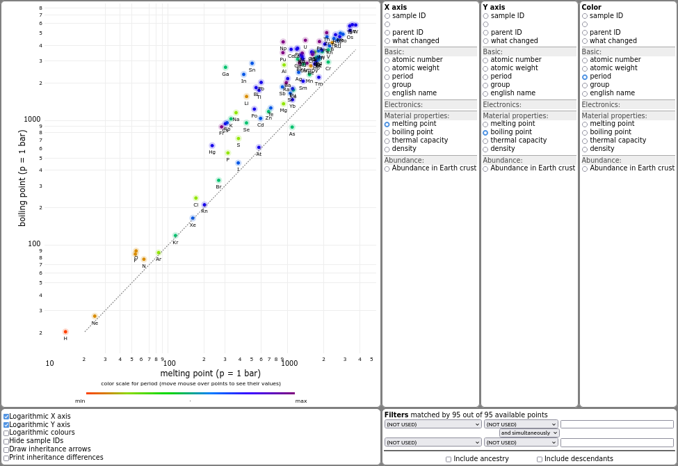
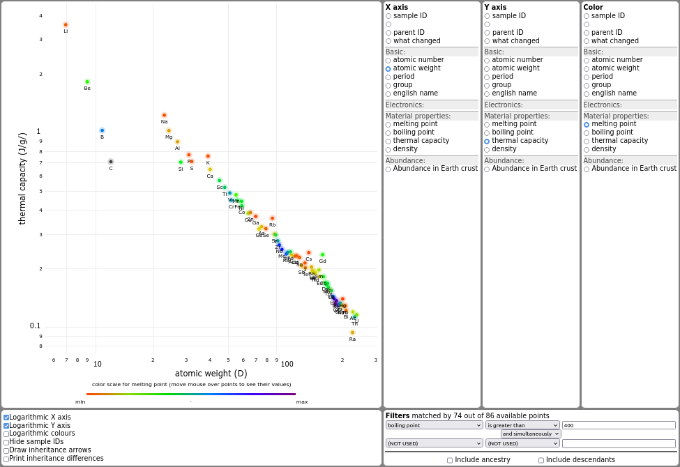

# googlesheet2scatterplot 

Among the most common graph types used in science are *scatter plots*, where individual points are placed into a two-coordinate plane. This project extracts data from a Google Sheet and displays them interactively on the screen as an interactive web page.  

While any decent spreadsheet processor can generate a scatter plot, there are good reasons to use a HTML/JavaScript page for it. The purpose of this project is to make viewing the datasets interactive, collaborative and to add several features that are useful for laboratory sample management:
* **Interactivity**: One mouse click in the right menu changes the quantity determining the X,Y position of the points, or their colour.
* **Collaboration**: When you add or change data in your google sheet, all your colleagues only have to refresh the page to see the changes. 
* **Special features**: There are several features that further simplify the analysis, as described at the end of this page.


----

# Additional features of the plotting HTML page

1. **Point color as a third axis:** Rainbow scale can show point grouping, or reveal their hidden higher-order correlations. Points with no valid data for color are plotted dark grey.
1. **Point relations:** Every point may refer to another point as its parent, since samples in laboratories are typically developed step by step, forming a large inheritance tree. The relations are displayed as arrows, optionally along with a description of each relation. 
1. **Filtering of data:** A simple filter can be applied to show only a subset of points. Two filtering rules are available and can be combined with logical "and"/"or" operand.
1. **Settings are immediately reflected in the address bar:** Copy the URL to share your current axes/colours settings with anybody whom you send this link.
1. **Visual parameter grouping:** The first row of the table denotes the parameter group, which can be folded. This saves screen space when there are over 20-30 parameters per point.
1. **Visual parameter highliting:** If you want to point out a new or otherwise interesting parameter (or group), just put an asterisk behind its name. It will be highlighted green.


----
# Example: Comparing chemical elements

To demonstrate how this project works, we provide 
1. a dataset containing basic information on chemical elements. You can view it at the [google sheets here](https://docs.google.com/spreadsheets/d/1K4z2Up7PbC__3yXLqWTkNsnOSVtqYm4u6FtFCVmyTXw/edit?gid=0#gid=0). Of course you can make your own copy to fill it with own data, as described below.
2. A running main webpage from this project, which has to be opened with the hash enabling it to load the data. 

Having assigned the period and group number in the periodic table to each element, the graph can arrange them to form an inverted periodic table as we know it.  

<a href="https://filipdominec.github.io/googlesheet2scatterplot/?x=group&y=period&c=period&fo1=(NOT%20USED)&fop=and&fo2=(NOT%20USED)&googleid=2PACX-1vRZbVmg68lEl8VS9DGa1rEDS5-V55Ome6JXc6Cs4UuGhAYUgHHZw1x1_f9AbvHlyDL8GmzRVxli0W-o">Try this interactive plot by period/group numbers</a>

Depending on the data filled in the table, many interesting correlations can be interactively examined.
For example, by two mouse clicks we can rearrange the elements to show how their boiling points are related to their melting points. We have also switched the X,Y axes to logarithmic scale. *This nicely shows that monoatomic noble gases have their boiling/melting temperatures very close, lying on the graph diagonal (automatically added dashed line). For most elements the temperature ratio lies around 1.5-1.8, whereas alkaline metals and similar elements (Hg, Bi, Pb) form a line at about 3.0. There are some outliers like (sublimating) As, or (covalently bound biatomic) liquid metal Ga. There is a lot of interesting physics to discuss, which is beyond the scope of this document.*


<a href="https://filipdominec.github.io/googlesheet2scatterplot/?x=melting%20point&y=boiling%20point&c=period&xlog=1&ylog=1&fo1=(NOT%20USED)&fop=and&fo2=(NOT%20USED)&googleid=2PACX-1vRZbVmg68lEl8VS9DGa1rEDS5-V55Ome6JXc6Cs4UuGhAYUgHHZw1x1_f9AbvHlyDL8GmzRVxli0W-o">Try the interactive plot by melting/boiling points</a>

It is similarly easy to show how thermal capacity per gram is almost inversely proportional to the atomic Z number. However, even here we can see some outliers, which is obviously related to the element's melting point (coded by colour).


<a href="https://filipdominec.github.io/googlesheet2scatterplot/?x=atomic%20weight&y=thermal%20capacity&c=melting%20point&xlog=1&ylog=1&fb1=boiling%20point&fo1=gt&fp1=400&fop=and&fo2=(NOT%20USED)&googleid=2PACX-1vRZbVmg68lEl8VS9DGa1rEDS5-V55Ome6JXc6Cs4UuGhAYUgHHZw1x1_f9AbvHlyDL8GmzRVxli0W-o">Try the interactive plot by Ct/melting points</a>


----

# Making your own Google Sheets with data

The core of this project is just a HTML/Javascript page, named **index.html**. All data are stored in a Google spreadsheet and all plotting is done in your browser.
Therefore, the **index.html** page can be used for as many data tables as you wish. You are also free to download and run this project locally, but as long as Github supports hosting the page linked above in the examples, there is no reason not to use this online instance. 

However, to plot your own data, you will have to create own sheet. There is a certain format the sheet has to obey. It is easiest to make a copy of the example Google sheet to fill it with your own column names (for measurement types), row names (for samples) and corresponding data values. Note that the table can be "sparse", i.e., missing data values in certain cells are not a problem. 

To make a plot your own data, make a copy of the underlying example table **https://docs.google.com/spreadsheets/d/1K4z2Up7PbC__3yXLqWTkNsnOSVtqYm4u6FtFCVmyTXw/edit#gid=0** and fill it according to your needs.  See  [our step-by-step guide](docs/howto.html) to generate a corresponding ```googleid=``` parameter that will allow the Javascript .

----

# Installation

The visualisation runs online. If you can see open examples, you don't have to install anything!


----

# Using Google API for automation

To further streamline your sample management, it is possible to let Google generate an API token for you, which enables your Python scripts to upload data without manual logging in. 

This step will, however, require running Python and following modules:

```
    pip install oauth2client
    pip install gspread
```


