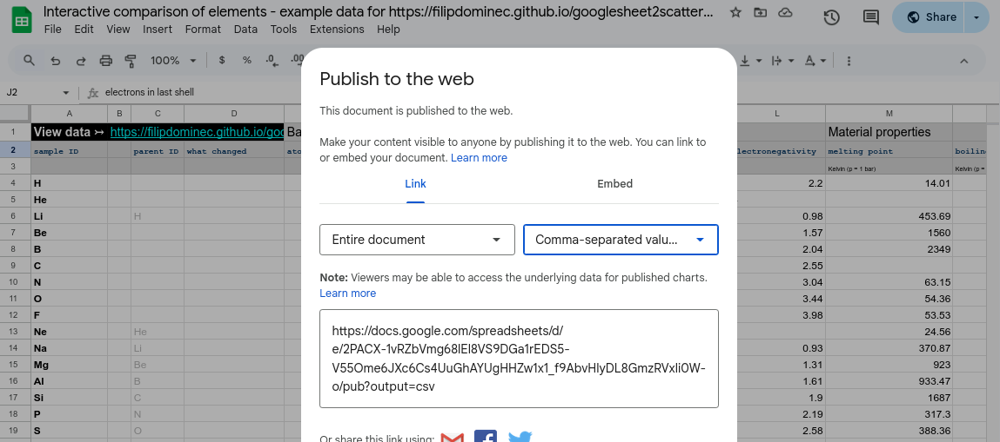

# googlesheet2scatterplot 

Among the most common graph types used in science are *scatter plots*, where individual points are placed into a two-coordinate plane. 

While any decent spreadsheet processor can generate a scatter plot, there are good reasons to use a HTML/JavaScript page for it. 

The main purpose of this project is to pull data from Google Sheets and visualise them in an interactive way. It has several features that are particularly useful for laboratory sample management:
* **Interactivity**: One mouse click in the right menu changes the quantity determining the X,Y position of the points, or their colour.
* **Collaboration**: When you add or change data in your Google Sheet, all your colleagues only have to refresh the page to see the changes. 
* Special features: There are several features that further simplify the analysis, as demonstrated in the example below.
   * **Color as a third axis:** Rainbow scale can represent point grouping, or reveal their hidden higher-order correlations. Points with no valid data for color are plotted dark grey.
   * **Point relations:** Every point may refer to another point as its parent, since samples in laboratories are typically developed step by step, forming a large inheritance tree. The relations are displayed as arrows, optionally along with a description of each relation. 
   * **Filtering of data:** A simple filter can be applied to show only a subset of points. Two filtering rules are available and can be combined with logical "and"/"or" operand.
   * **Settings are immediately reflected in the address bar:** Copy the URL to share your current axes/colours settings with anybody whom you send this link.
   * **Visual parameter grouping:** The first row of the table denotes the parameter group, which can be folded. This saves screen space when there are over 20-30 parameters per point.
   * **Visual parameter highliting:** If you want to point out a new or otherwise interesting parameter (or group), just put an asterisk behind its name. It will be highlighted green.
   * **Mouse hover info:** Moving the mouse cursor above a point shows its exact X, Y and color values, as well as description and inheritance information.


----
# Example: Comparing chemical elements

To demonstrate how this project works, we provide 
1. a dataset containing basic information on chemical elements. You can view it at the [google sheets here](https://docs.google.com/spreadsheets/d/1K4z2Up7PbC__3yXLqWTkNsnOSVtqYm4u6FtFCVmyTXw/edit?gid=0#gid=0). Of course you can make your own copy to fill it with own data, as described below.
2. A running main webpage from this project, which has to be opened with the hash enabling it to load the data. 

Having assigned the period and group number in the periodic table to each element, the graph can arrange them to form an inverted periodic table as we know it.  

<a href="https://filipdominec.github.io/googlesheet2scatterplot/?x=group&y=period&c=period&fo1=(NOT%20USED)&fop=and&fo2=(NOT%20USED)&googleid=2PACX-1vRZbVmg68lEl8VS9DGa1rEDS5-V55Ome6JXc6Cs4UuGhAYUgHHZw1x1_f9AbvHlyDL8GmzRVxli0W-o">Try this interactive plot of period and group numbers</a>

Depending on the data filled in the table, many interesting correlations can be interactively examined.
For example, by two mouse clicks we can rearrange the elements to show how their boiling points are related to their melting points. We have also switched the X,Y axes to logarithmic scale. *This nicely shows that monoatomic noble gases have their boiling/melting temperatures very close, lying on the graph diagonal (the dashed line is automatically added whenever 3rd line's annotation has the same physical unit). For most elements the temperature ratio lies around 1.5-1.8, whereas alkaline metals and similar elements (Hg, Bi, Pb) form a line at about 3.0. There are some outliers like (sublimating) As, or (covalently bound biatomic) liquid metal Ga. There is a lot of interesting physics to discuss, which is beyond the scope of this document.*


<a href="https://filipdominec.github.io/googlesheet2scatterplot/?x=melting%20point&y=boiling%20point&c=period&xlog=1&ylog=1&fo1=(NOT%20USED)&fop=and&fo2=(NOT%20USED)&googleid=2PACX-1vRZbVmg68lEl8VS9DGa1rEDS5-V55Ome6JXc6Cs4UuGhAYUgHHZw1x1_f9AbvHlyDL8GmzRVxli0W-o">Try the interactive plot of melting and boiling points</a>

It is similarly easy to show how thermal capacity per gram is almost inversely proportional to the atomic Z number. However, even here we can see some outliers, which is obviously related to the element's melting point (coded by colour).


<a href="https://filipdominec.github.io/googlesheet2scatterplot/?x=atomic%20weight&y=thermal%20capacity&c=melting%20point&xlog=1&ylog=1&fb1=boiling%20point&fo1=gt&fp1=400&fop=and&fo2=(NOT%20USED)&googleid=2PACX-1vRZbVmg68lEl8VS9DGa1rEDS5-V55Ome6JXc6Cs4UuGhAYUgHHZw1x1_f9AbvHlyDL8GmzRVxli0W-o">Try the interactive plot of thermal capacity by Z number</a>

----

# Installation

The visualisation runs as a page in your web browser and Github has provided hosting for it. If you can see the examples online, you don't have to install anything!

To get your own data table you will need to make a Google account if you haven't it yet.

You will only need to install additional python modules if you wish to automate your work and upload data by Google API. The installation steps are described at the end of this document. You will also have to use your Google account to generate a token in order to allow your scripts to upload data without asking for a password. 

----

# Preparing another Google Sheet for your own data

The core of this project is one HTML/Javascript page, named **index.html**. 

Each dataset to be plotted is stored in separate Google spreadsheet. 

Therefore, the **index.html** page already linked in the above examples can be used for as many datasets as you wish, each of which will have a different ```googleid=``` parameter. Alternately, you are also free to download and open (or self-host) this page locally, but unless you want to develop the HTML/Javascript code, there is no reason not to use this single online instance.

## Preparing your Google Sheet

To get an editable sheet for your own data, make a copy of the underlying example table **https://docs.google.com/spreadsheets/d/1K4z2Up7PbC__3yXLqWTkNsnOSVtqYm4u6FtFCVmyTXw/edit#gid=0** and fill it according to your needs. Click *File -> Make a Copy* in the main menu, then confirm the button *Make a Copy*. Rename it as you wish.


> [!NOTE]
> Note that the Javascript code expects a certain cell structure of the sheet. For completeness, we list the rules in the following table. 
>
> But if you made a copy of the example Google sheet, it is intuitive to adapt it to your needs without reading it; just insert your own column names (for measurement types), row names (for samples) and corresponding data values. At any rate you will need to generate a new `googleid` for it as described in the next subsection.

<details>
  <summary><ins>Description of the required Google Sheet structure</ins></summary>

The first sheet (i.e. tab) of the document must follow this format, but further sheets *may* be added and will be ignored by the web page. Also any graphical formatting of the sheet cells is ignored, you may e.g. use coloring freely. 

Part of the sheet | Cells | Content
----------------- | ----- | -------
First row | E1, F1, G1... | *may* be the categories to sort the sample parameters. Non-empty entries start a new category to which further columns to the right belong until another category starts.
Second row | E2, F2, G2... | *must* be parameters
Third row | E3, F3, G3... | *may* be physical units, measurement conditions or any other information related to the column. When the units are detected the same on X and Y axes, a diagonal line is automatically added as a guide for the eye.
First column | A4, A5...  | must be unique names of the samples. The name of the first column in cell A2 ```sample ID```.
Third column | |  *may* contain references to the parent sample's ID, this column's name in cell C2 is ```parent ID```
Fourth column | |  *may* contain text describing the difference from the parent sample's ID, this column's name in cell D2 is ```what changed```
Remaining  | |  cells contain arbitrary numbers or text (which cannot be numerically represented, but can be useful for sample filtering). equations referring Note that the table can be "sparse", i.e., missing data values in certain cells are not a problem. 

</details>

## Generating the `googleID` hash

The Javascript page uses the URL parameter ```googleid=```  to download the data in from Google. These exported data are stored only locally and after some filtering and preprocessing, the Plotly.js library is used to plot them in your browser. We thus have to ask Google to generate the secret key that allows your browser to access the exported data, and pass it to the index.html page as an URL parameter. 

With the Google Sheets opened in the browser, select the option *File -> Share -> Publish to Web* in the main menu.

A form appears where you have to stay on the *Link* tab, and select that *Entire document* shall be exported as *Comma-separated values (.csv)*: 



## Composing an URL with the new googleID

Below, the form shows a quite long URL. It contains the required ```googleid``` hash that only has to be copied into the URL for the index.html. For example, if you get: 

```
 https://docs.google.com/spreadsheets/d/e/2PACX-1vRZbVmg68lEl8VS9DGa1rEDS5-V55Ome6JXc6Cs4UuGhAYUgHHZw1x1_f9AbvHlyDL8GmzRVxli0W-o/pub?output=csv
                                          ^^^^^^^^^^^^^^^^^^^^^^^^^^^^^^^^^^^^^^^^^^^^^^^^^^^^^^^^^^^^^^^^^^^^^^^^^^^^^^^^^^^^^^
```

Copy the ```2PACX........-o``` part (130 bytes long) after the URL of our plotting page:

```
 https://filipdominec.github.io/googlesheet2scatterplot/?googleid=
```

... so that you get for example: 

```
 https://filipdominec.github.io/googlesheet2scatterplot/?googleid=2PACX-1vRZbVmg68lEl8VS9DGa1rEDS5-V55Ome6JXc6Cs4UuGhAYUgHHZw1x1_f9AbvHlyDL8GmzRVxli0W-o
```

This is the link you need to open to see your data.


----

# Using Google API for automation

Generating an Google API token for you will your Python scripts to upload data instead of manual entering them through Google Sheets web interface. 

This step will, however, require running Python and following modules:

```
    pip install oauth2client
    pip install gspread
```

Note the Python scripts will link to the Google Sheet by its title, not by googleid hash: Renaming a sheet will not break its Javascript visualisation, but will break uploading.

